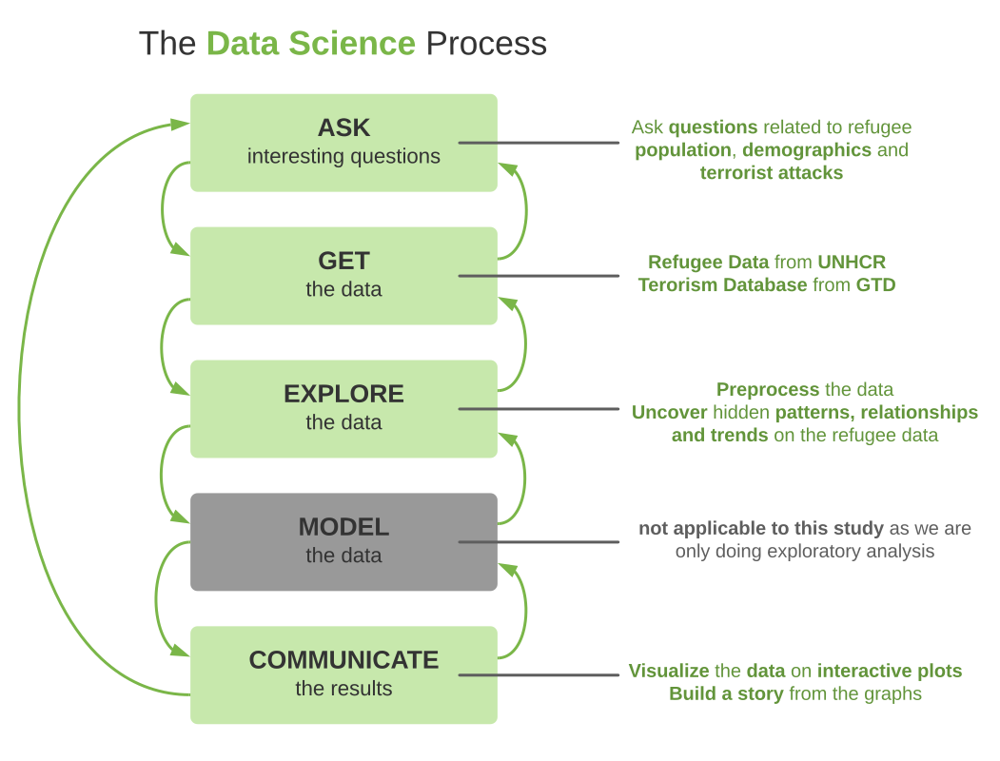
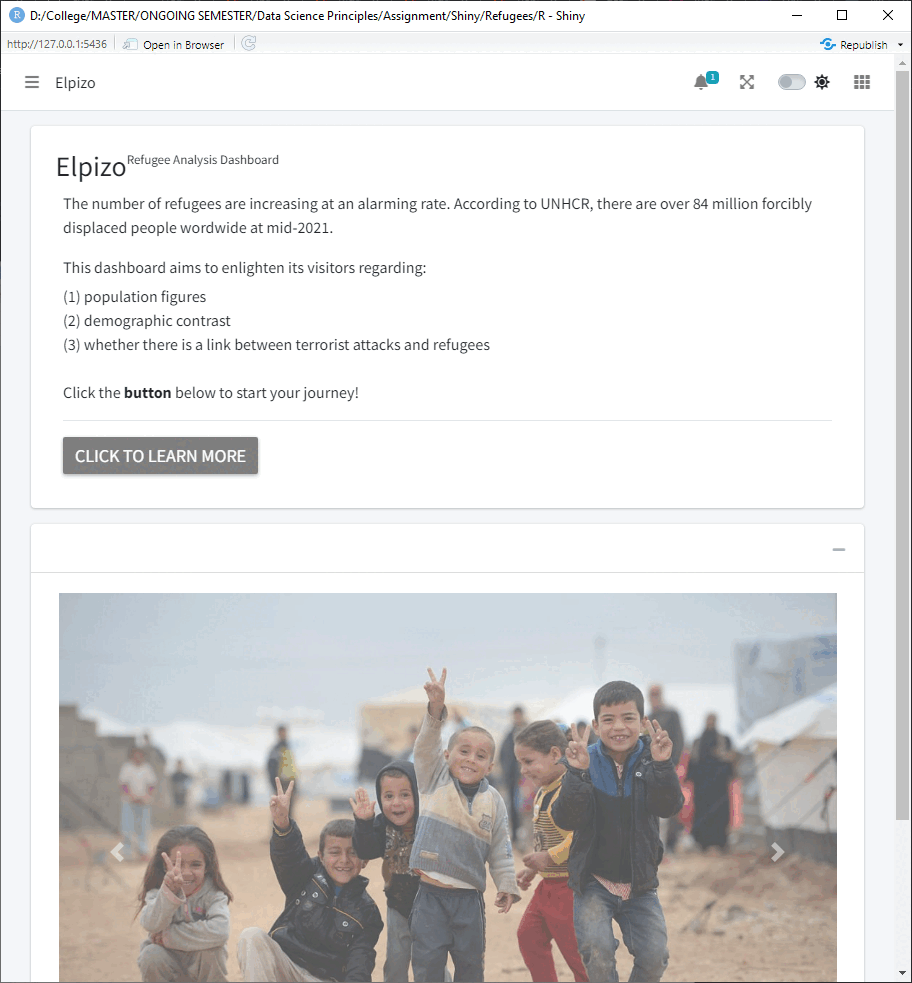

<style>
  h1 {
  
  }
</style>

```{r setup, include=FALSE}
knitr::opts_chunk$set(echo = FALSE)
```

## Background

The refugees' problem is a hot topic in contemporary society nowadays. There are over 84 million forcibly displaced people worldwide at mid-2021. Irrespective of refugees' race, color, religion and nationality, precious lives are at stake. 

In this study, we wish to explore the population and demographics of refugees — and to answer a question most people had in mind at some point — <br/>their relationship to terrorist attacks.

### <b>Questions:</b>

1. Is there a disparity in the age groups for the number of refugees?
2. Is there a difference in gender for the flow of refugees?
3. Which countries of asylum are the most accepting of refugee populations?
4. Does the refugee population correlate with the number of terrorist attacks in the country of asylum?

##

<style>
.center {
  display: block;
  margin-left: auto;
  margin-right: auto;
}
</style>



<small style="font-size: small">by Joe Blitzstein and Hanspeter Pfister</small>

## Main Features

<style>
.row {
  display: flex;
}

.column {
  flex: 50%;
}
</style>

<div class="row">

  <div class="column">
  <b>1. Overview</b><br/>
  An interactive map of the refugee population with a year range.
  
  <b>2. Population</b><br/>
  Refugee population statistics visualized using various interactive charts.
  
  <b>3. Demographics</b><br/>
  The age and gender comparisons for the refugee populations.
  
  <b>4. Attacks</b><br/>
  Explore the correlation between the flow of refugees and terrorist attacks.
  <br/><small style="font-size: small">and many more!</small>
  </div>
  
  <div class="column">  </div>
  
</div>

## Conclusion

### **Experiences:**

- A deep dive into the data science processes
- Ability to preprocess different dataset shapes
- The creation of a dashboard using Shiny
- Explore different charts to visualize information efficiently
- Apply `deon` — Data Science Ethics Checklist

### **Our Work:**

<style>
.img-with-text {
    text-align: left;
    width: 100px;
    float: left;
}

.img-with-text img {
    display: block;
    margin: 0 auto;
}

.img-with-text p {
    font-size: 16px;
}
</style>

<div>

<div class="img-with-text" style="padding-right: 3rem !important; cursor: pointer;" onclick="window.open('https://zahirsher.shinyapps.io/Refugee-Dashboard/','mywindow');">
  
  <p style="padding-top: 0.6rem;padding-left: 0rem;text-align: center;font-weight: bold;">View Elpizo Shiny App</p>
</div>

<div class="img-with-text" onclick="window.open('https://github.com/zahir2000/Refugee-Analysis','mywindow');" style="cursor: pointer;">
  
  <p style="text-align: center;padding-top: 0.6rem;font-weight: bold;">View Source Code</p>
</div>

</div>
  


```{r conclusion}

```

